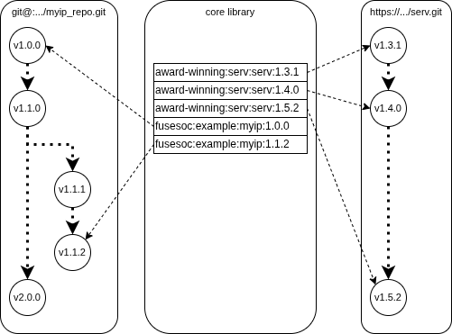

# FuseSoC monorepo examples

Working with monorepos introduces some extra challenges when it comes to versioning of individual components. Normally, only the currently visible version of each component is easily accesible which makes it harder to e.g. refer to an older version of a dependency.

The problem is not unique to FuseSoC, but this repo contains FuseSoC-specific alternatives to work with multiple versions of the same core for users who work in a monorepo workflow.

## Introduction

The most important thing before looking at these examples is to understand versioning, the difference between local and remote cores and how the provider section works.

### Versions

It is possible to have multiple versions of the same core in the FuseSoC libraries. Let's assume we have multiple versions of the award-winning SERV, the world's smallest RISC-V CPU

```
award-winning:serv:serv:0.2.0
award-winning:serv:serv:1.3.1
award-winning:serv:serv:1.4.0
award-winning:serv:serv:1.5.2
```

Adding a dependency on `award-winning:serv:serv` will by default pick the latest version (unless some other constraint is in place). To pick a specific version, you can use e.g. `=award-winning:serv:serv:1.4.0` or `>=award-winning:serv:serv:1.3.1` to choose the best version within a range of options. A lock file can also be used to force a specific version.

### Local cores

If you have a monorepo you most likely have local cores. This means that you have a core description file that is stored together with the code, like the following directory setup:

```
myip/
├─ myip.core
├─ rtl/
│  ├─ myip_top.sv
│  └─ my_ip.sv
└─ tb/
   └─ my_ip_tb.sv
```

The corresponding core description file might look like this:

```yaml
CAPI=2:

name: fusesoc:example:myip:0.1.2
description: My IP core

filesets:
  rtl:
    files: [rtl/myip.sv, rtl/myip_top.sv]

  tb:
    files: [tb/myip_tb.sv]

targets:
  sim:
    filesets: [rtl,tb]
    filters : [autotype]
    flow: sim
    flow_options : {tool : icarus}
    toplevel : myip_tb
```

All file names in the core description file are relative the location of the core description file itself, i.e. the core description file is *local* to the code.

### Remote cores

A *remote* core means that the core description file is located some else than the source code. This of course leads to the question how FuseSoC finds the source code. The answer to that is the *provider* section. This section tells FuseSoC where to find the source code. It also tells FuseSoC *how* to access the code, which can e.g. be stored in a git or subversion repository, or as a zip/tar.gz archive accessible over http. When FuseSoC needs the code, it downloads it to a cache (normally in ~/.cache/fusesoc/<flattened vlnv>) for subsequent use.

Adding the following to the core description file above, would turn it into a remote core that accesses its source code through git.

```
provider:
  name : git
  repo : git@example.com:path/to/myip_repo.git
  version : v0.1.2
```

Using the above provider section would fetch the requested repo at the requested version and store that in the cache as `fusesoc:example:myip:0.1.2`. There are no restrictions on the versions. It can be either a tag or a commit SHA for the git provider. The core description file can be located anywhere, e.g. locally on the disk or in another git repo.

Note that the file names are still relative to some defined directory. For git repositories this means that they are relative to the repo root. If myip would be stored in a subdirectory in the repo, as is often the case for monorepos, then we would need to prefix all filenames with the complete path from the repo root.

Also note that if there was a core description file in the repo stored together with the code, FuseSoC will ignore that since it will just end up as another file in the cache.

The typical workflow when using remote cores is to have each IP in a separate repo and then an additional repo with all the (remote) core description files which points to different versions of the source code repos.



This workflow typically uses a mix of local and remote cores, where the cores currently being worked on use local cores and the rest of the dependencies use remote cores. There is also no strict requirement that each core uses a separate repo. Related cores can be grouped together into the same repo. There are some caveats to this however which are described below in the section on monorepos with remote cores.

## Monorepo Workflows

There are different alternative monorepo workflows that can be used, each with pros and cons. In all scenarios we assume a top-level core that depends on a sub-level core of which there exist multiple versions to choose from. Each of the workflows comes with a runnable example. The following instructions sets up everything to run the examples in the subsequent sections.

```
# Create and enter a workspace
mkdir workspace && cd workspace

# Add the monorepo examples (this repo) as a library
fusesoc library add https://github.com/fusesoc/monorepo-example

# Check that the example cores appear as expected
fusesoc core list
```

### Multiple copies in repo

The simplest way to have multiple versions in a monorepo is to make several copies of the core and store them all. The [sidebyside example](https://github.com/fusesoc/monorepo-example/tree/main/sidebyside) shows how to do this. This method is not really recommended as it will likely become very messy to have multiple copies of the same core in the repo. It might be an option though if there are only a few cores that get this treatment, e.g. for vendored third-party cores that might exist in a couple of different versions.

### Multiple copies with dev version in repo

A slight variation of the workflow above is to make (preferably read-only) archive copies of stable versions of the cores somewhere else. This can be a separate repo or plain storage. In this workflow only the version in the repo is under development. It can be wise to set the version number of the core under development to an arbitrary high number (like 999.9.9) to make sure that it is always picked as the latest version. In this case, don't forget to set the correct version number on the archived cores.

### URL provider

Another variation of using multiple copies is to package stable IP cores as zip/tar.gz archives and make these available over http. This allows FuseSoC to use the URL provider to fetch them as remote cores.

### Monorepo as remote core

Monorepos with remote cores technically work the same as with a polyrepo setup.
There's nothing technicallly stopping users from putting all cores into the same repo with individual versioning. Ther are however two practical limitiations to this approach.

Remote cores, when using git, use the repo root as the root directory for the source files. This means that any path to a source file must be relative to the repo root. If a local core that resides in a subdirectory in the repo is converted to a remote core, all paths must be prefixed with the subdirectory. This makes it more complicated to convert between local and remote cores.

Each version of each core will need to check out the complete repo to their respective cache. For a larger repo this can become impractical when the repo size or number of cores grow.
